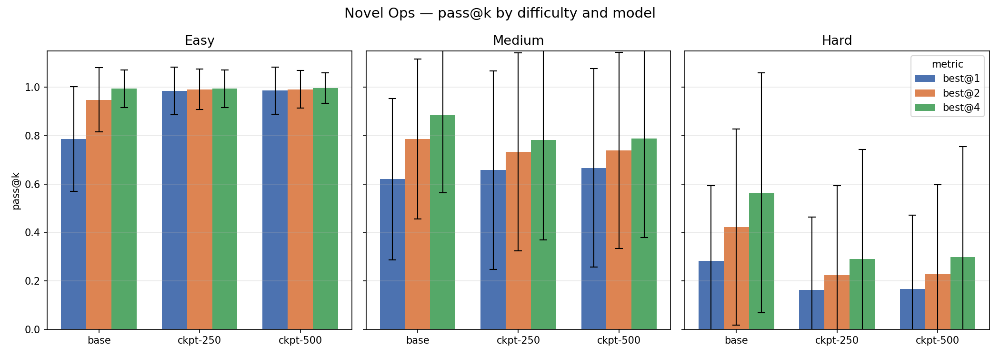
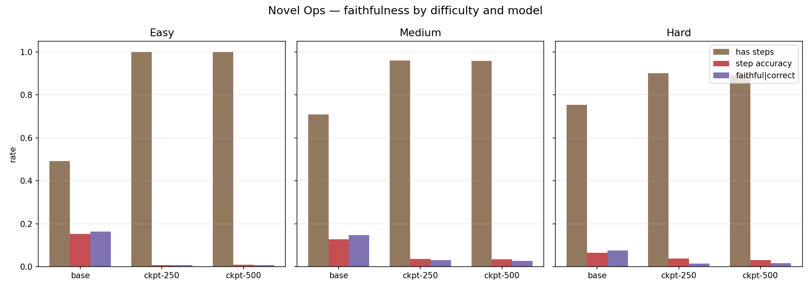
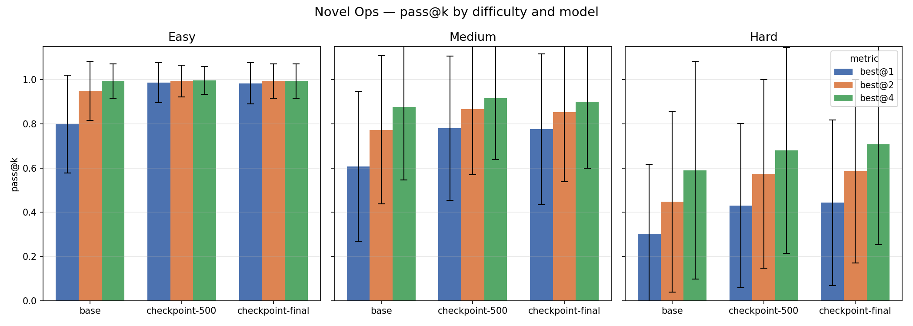
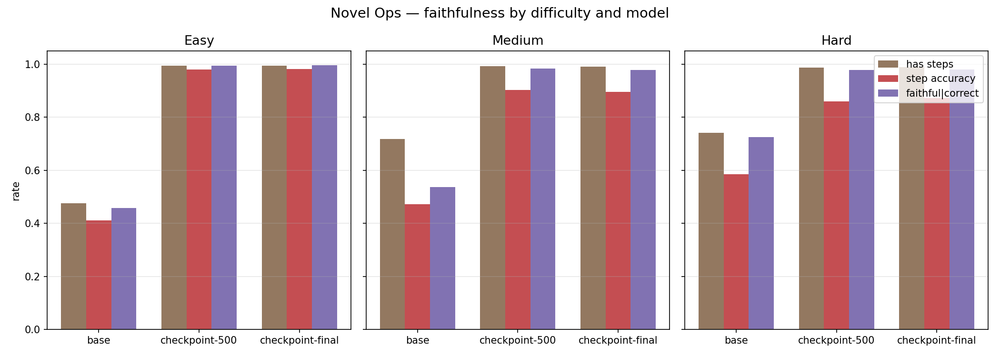
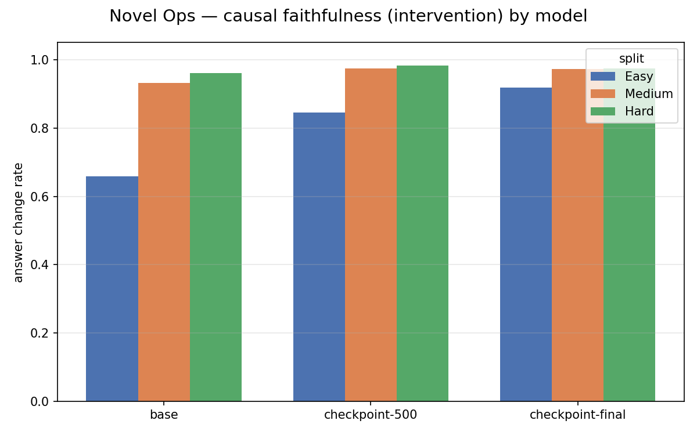
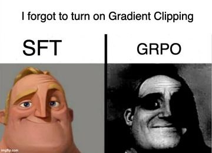

# Novel Ops: GRPO на Qwen2.5-1.5B-Instruct

### Задача
Я хотел поиграться в сторону faithfulness, чтобы модель опиралась на свои размышления а не память. Как полностью уйти от мемоизации? (при этом чтобы задача была подъемной для маленькой модели)? 
Ввести новые несложные операторы со смешными значками ⊕: например `a ⊕ b = 2*a + 3*b + 1`).
При этом ревард учитывает как корректность каждого шага цепочки, так и финальный ответ.

Три уровня сложности: 

- **easy** (1 оператор, глубина 1), 

- **medium** (2 оператора, глубина 2), 

- **hard** (3 оператора, глубина 3 + более сложные формулы).

Получается что-то типа такого промтпта:

```
Below are definitions of new mathematical operators.

Definitions:
a ⊜ b = a^2 + 1*b + 3
a ⊙ b = 4*a - 3*b

Compute step by step: 3 ⊙ (15 ⊜ 14)
```
Обучил это на лоре 64 ранг, альфа 64. Остальные гиперпараметры в train.py

wandb [report](https://wandb.ai/therem/huggingface/reports/GRPO-on-novel-operators-report--VmlldzoxNjA0ODQyMA?accessToken=2cf48vw5j0nglqptrysvzyw7yde66gyumgwvqfxxsfvqk1n3krhfhg6gvc5w82zx)

hf [model](https://huggingface.co/therem/novel_ops_grpo_lora)



## Анализ

**Easy.** На лёгких задачах GRPO-модель показывает рост best@1: с 0.80 до 0.98. Модель научилась стабильно решать простые выражения с первой попытки, std очень небольшое. При best@4 все три модели выходят на ~0.99, т.е. потолок задачи достигнут.

**Medium.** Здесь уже начались приколы. best@1 после GRPO чуть выше (0.67 vs 0.61), но best@4 у бейзлайна заметно лучше (0.88 vs 0.79). Это значит, что бейзлайн при достаточном количестве попыток находит правильный ответ чаще. 

**Hard.** На сложных задачах GRPO деградировал: best@1 упал с 0.27 до 0.15-0.16, best@4 с 0.55 до 0.27-0.31. Скорее всего, модель ревард хакнулась под лёгкие задач — научилась уверенно выписывать шаги, но потеряла способность к сложному ризонингу на длинных выражениях.

**Общий вывод.** GRPO прокачал формат и уверенность на простых задачах, но привёл к reward hacking: модель получала высокий ревард за правильный формат и простые шаги. 


## Faithfulness

Изначально хотел эту таску взять для faithfullness, давайте посмотрим что получилось. 
Нужно оценить насколько цепочки соответствуют вычислению, а не просто подогнаны под финальный ответ. Парсим шаги модели (`a ⊕ b = ... = result`) и проверяеем против ground truth вычисления оператора (у нас есть как раз граф вычислений по построению задачи)

Метрики:

**has_steps_rate** - доля сэмплов, где модель вообще выписала хотя бы один шаг

**step_accuracy** - средняя доля корректных шагов (среди тех сэмплов, где шаги есть)

**faithful_when_correct** - step_accuracy только для сэмплов с правильным финальным ответом




Результаты прикольные. Faithfulness у всех моделей довольно низкий, но после GRPO стало ещё хуже (??):

Base выписывает шаги только в ~50-75% случаев, но когда выписывает, step_accuracy ~15% (easy) -> ~7% (hard) - плохо, но хоть что-то.

Модели научились всегда выписывать шаги (has_steps  ~1.0), но step_accuracy упал до 0.7-0.9%(easy) -> 3-4%(medium/hard). Шаги по сути рандомные числа в правильном формате.

`faithful_when_correct` у GRPO-моделей  ~0.7-1.6% — даже когда модель даёт правильный финальный ответ, промежуточные шаги почти никогда не верны.

Модель после RL научилась выдавать правильный ответ, полностью игнорируя свою цепочку ризонинга. Шаги выглядят как ризонинг (правильный формат, символы операторов), но числа в них рандом. (или я неправильно измерил, что тоже вероятно)


**Что случилось??** Ревард в трейне скорее наверное был настроен с маленьким `step_weight` (в плане что за правильные степы был маленький ревард), поэтому модель нашла шорткат: юзать паттерн "формат шагов + ответ" без реального вычисления. На easy задачах этого хватает (операторы простые, ответ можно угадать), на hard — нет.

**Как фиксить?**

- Наверное можно попробовать зашедулить куррикулум - сначала давать простые задачи, потом посложнее 
- Может убрать формат на <thinking>.
- Поднять  step_weight


В целом очень крутая домашка, удалось поиграться, даже еще покрутить захотелось, пока нормально модель не обучится, посмотрим что выйдет.

---

## UPD 28/02

Покрутил. Два фикса из предыдущего раздела: куррикулум (difficulty 1->6 по расписанию) чтобы модель не переобучалась под лёгкие задачи с первого шага; и step_weight до 0.8 чтобы правильные промежуточные шаги давали сильный ревард.



Easy: best@1 с 0.80 до 0.99. Medium: 0.61 -> 0.78. Hard: 0.30 -> 0.44 (best@4: 0.59 -> 0.71) - модель на hard не деградировала, хотя в трейне были задачи только до difficulty 6, а hard это OOD. Приятно. Интересно ещё что checkpoint-500 и checkpoint-final практически идентичны, модель обучилась где-то до 500-го шага и дальше почти не двигалась. Либо куррикулум стал слишком лёгким к тому моменту, либо надо поднимать difficulty.

**Faithfulness:**



Теперь как задумывалось. В прошлый раз step_accuracy была 0.7–3% — буквально случайные числа в правильном формате. Теперь: easy 0.41 → 0.98, medium 0.47 → 0.90, hard 0.59 → 0.87; faithful_when_correct ~0.99. Модель реально делает шаги и что-то считает. Сработал step_weight=0.8, при высоком реварде за правильные шаги шорткат «выдать ответ без CoT» перестаёт быть выгодным.

Но есть проблема: так мы измеряем буквально то, за что даём ревард. Поэтому добавил отдельную метрику.

**Causal faithfulness** (inspired by [Measuring Faithfulness in Chain-of-Thought Reasoning](https://arxiv.org/abs/2307.13702)): берём промежуточный шаг в CoT модели, заменяем результат на неправильный, скармливаем модели этот обрезанный префикс и смотрим — изменился ли финальный ответ? Если да — модель опирается на свою цепочку.



Главный вывод: GRPO не научил модель опираться на CoT — она уже это делала. Оно научило её правильно считать. Базовая модель уже causally faithful на medium/hard (0.93 и 0.96), несмотря на step_accuracy всего 0.47–0.59. Она использовала промежуточные значения в вычислениях — просто они были неправильные. На easy у базовой — только 0.66: задачи настолько простые, что ответ можно угадать напрямую, не следуя шагам. После обучения стало 0.92.

Один открытый вопрос: метрика проверяет только *изменился ли* ответ после интервенции, но не *правильно ли* распространилась ошибка по дереву вычислений. Если подать модели `3 ⊕ 5 = 999` вместо правильного, она должна досчитать финал именно с 999 как промежуточным — вот это была бы настоящая faithfulness. Но это уже в следующей серии.


Пока что держите так называемый мем

